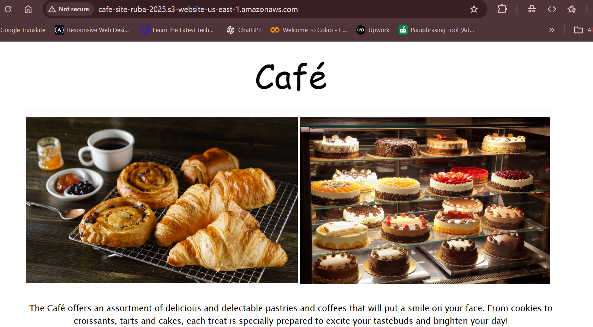
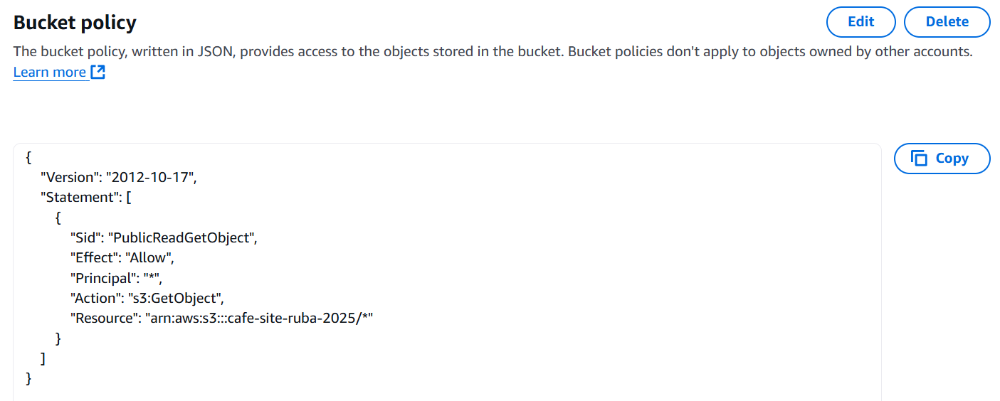
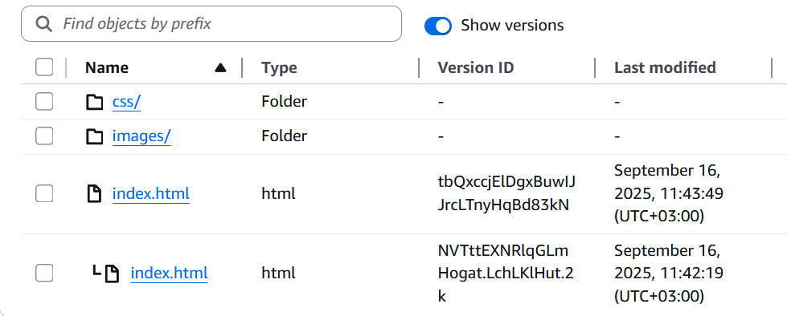
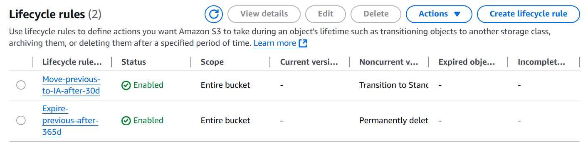
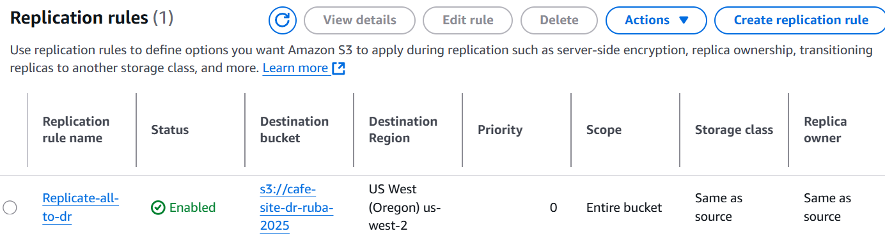

# Café Static Website on Amazon S3

A static website for a café hosted on **Amazon S3** with best practices:

- Static Website Hosting + public read via **Bucket Policy**
- **Versioning** for protection against accidental deletes/overwrites
- **Lifecycle rules**: previous versions → Standard-IA (30 days), expire after 365 days
- **Cross-Region Replication (CRR)** for Disaster Recovery

## Structure
- `index.html`
- `images/`
- `css/`

## How I deployed
1) Created an S3 bucket (us-east-1) and enabled **Static website hosting**  
2) Set a **Bucket Policy** for public read on objects  
3) Enabled **Versioning**  
4) Configured **Lifecycle** (move previous versions to Standard-IA after 30 days, expire after 365 days)  
5) Enabled **Cross-Region Replication** to a bucket in another region

> Screenshots are in the `docs/` folder.
## Screenshots
- Static website hosting enabled  
  

- Public read via bucket policy  
  

- Versioning & object versions  
  

- Lifecycle rules  
  

- Replication rule  
  

